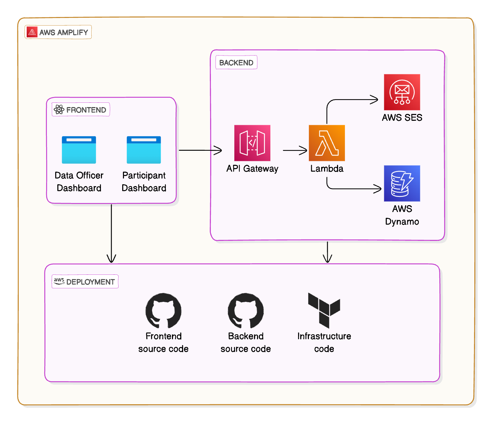
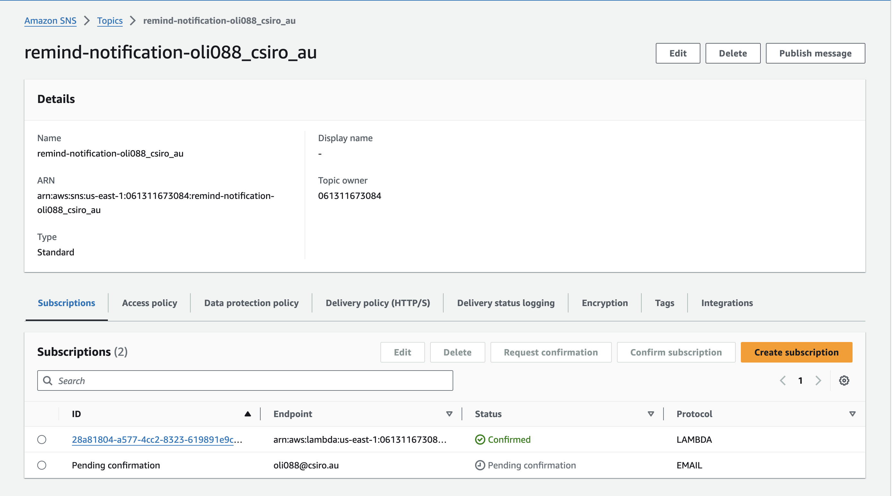
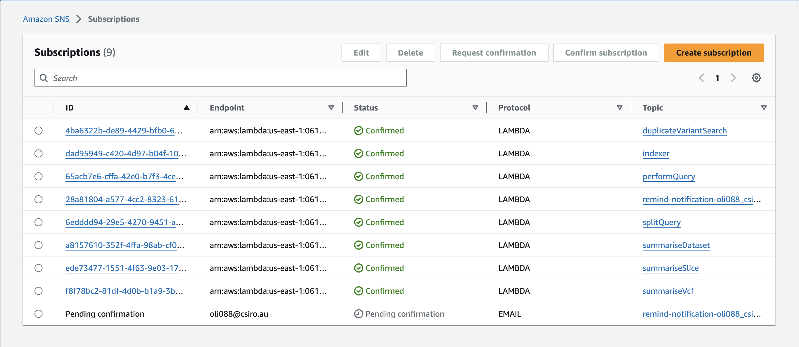
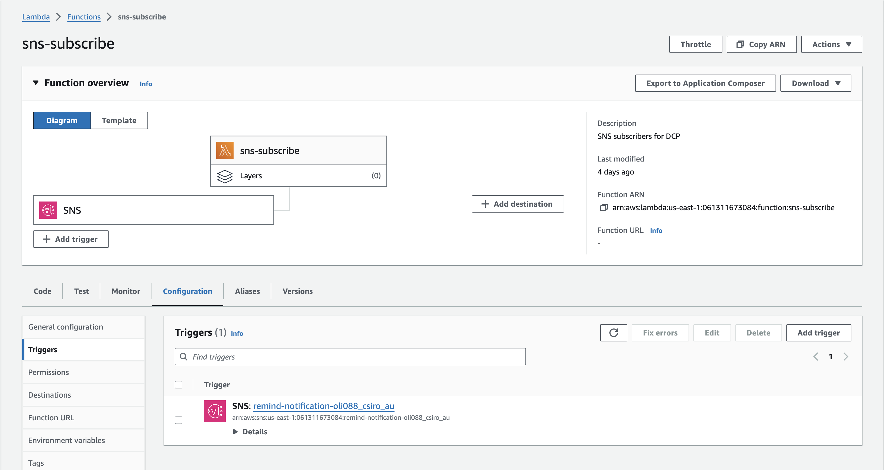
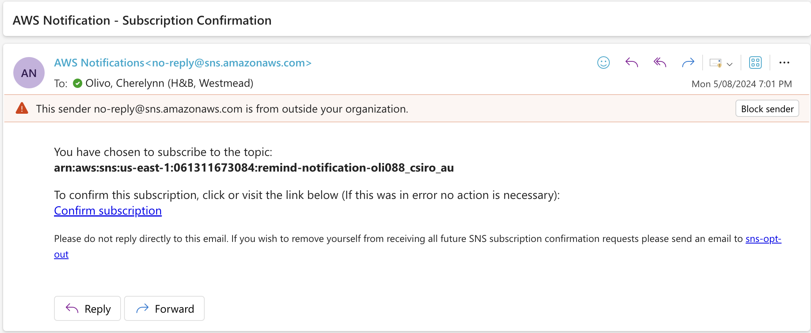
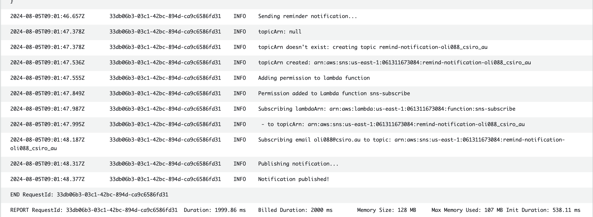
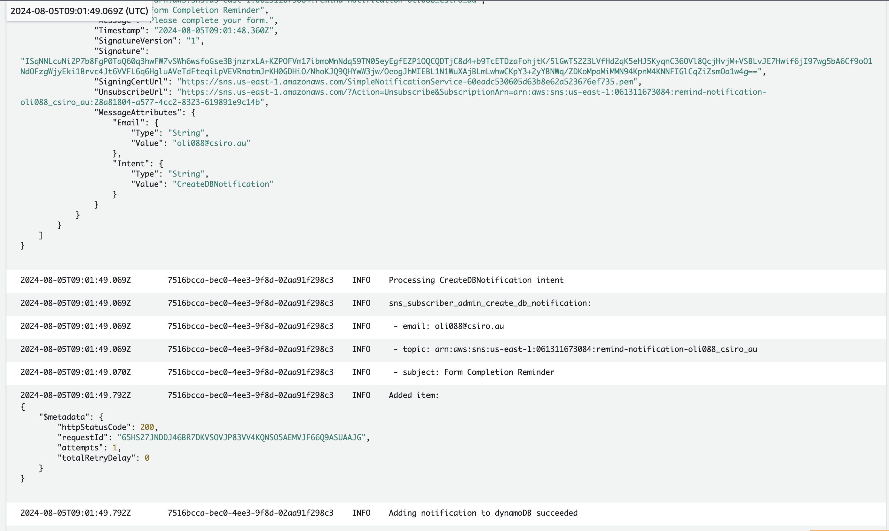
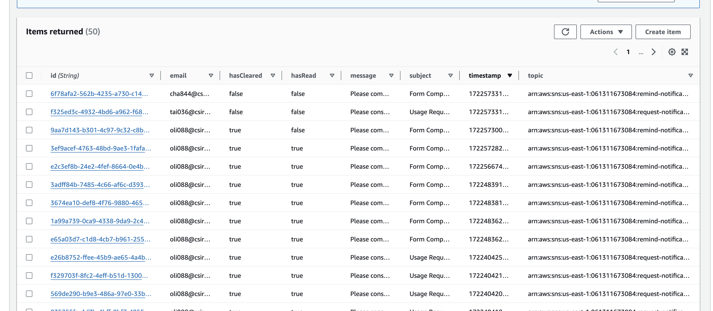

---
tags:
  - React
  - AWS
  - Dynamodb
  - AWS-SNS
  - AWS-Lambda
  - AWS-Gateway
  - MUI
  - AWS-Cloudwatch
date: 05/08/2024
---
# CSIRO Dynamic Consent Platform
## Context
### Purpose of the project

The primary objective is to empower patients and research participants to dynamically manage their consent for genomic information usage. The Dynamic Patient Consent (DPC) project emphasises usability, security, and compliance with data protection standards, leveraging modern frontend and backend technologies. To develop a comprehensive DPC platform that allows patients and research participants to dynamically consent to or revoke consent for the use of their genomic data. This platform aims to enhance autonomy and control over personal data usage, facilitate secure and efficient communication between stakeholders, and ensure compliance with relevant data protection standards.
### Current state of the project  
The project currently includes a login system, basic interfaces, and forms for registration and consent management. The backend and frontend frameworks have been set up using NodeJS and ReactJS, respectively.

## Scope
- Developing both the frontend and backend components of the DPC platform.    
- Secure communication via an email-based system to manage consent requests and notify participants of changes
- Be able to send an email and in-app notification by the data officer to the participant.
- Be able to receive an email and in-app notification as a participant filling out a form.
- Content of the notification is dependent on the use case, currently we want to handle 2 use cases:
- Requesting data usage: this refers to when a researcher/clincian wants to use the POLOS genomic dataset but doesn’t have the adequate consent given. The data office can review this request and notify the participant if they are willing to update their consent form to allow this new usage.
- Consent form reminder: To make sure consent forms are filled out till the end, the data officer can opt in to a notification type reminder to the participant of the consent form to finish their form. This is ensure the consent form completion rate can increase.
- Be able to view participant contact details to manually call for any reason (e.g. a form has been not completed for an extended period).
## Infrastructure

## Working demo
### Admin able to send a notification
#### UX 
See below for the UX of what this looks like

Notice that
- The loading state is handled correctly
- The users from the forms are passed in correctly
- The success event is paired with the success toast at the bottom right

In the backend, we can validate that the notification did indeed come through

| Topics     | Subscribers    |
| ---------- | -------------- |
|  |   |
#### Lambda subscriber

#### Email subscriber

#### Cloudwatch logs
##### admin-service

##### sns-subcribe

## Participants notification
### UX
#### DynamoDB entry

